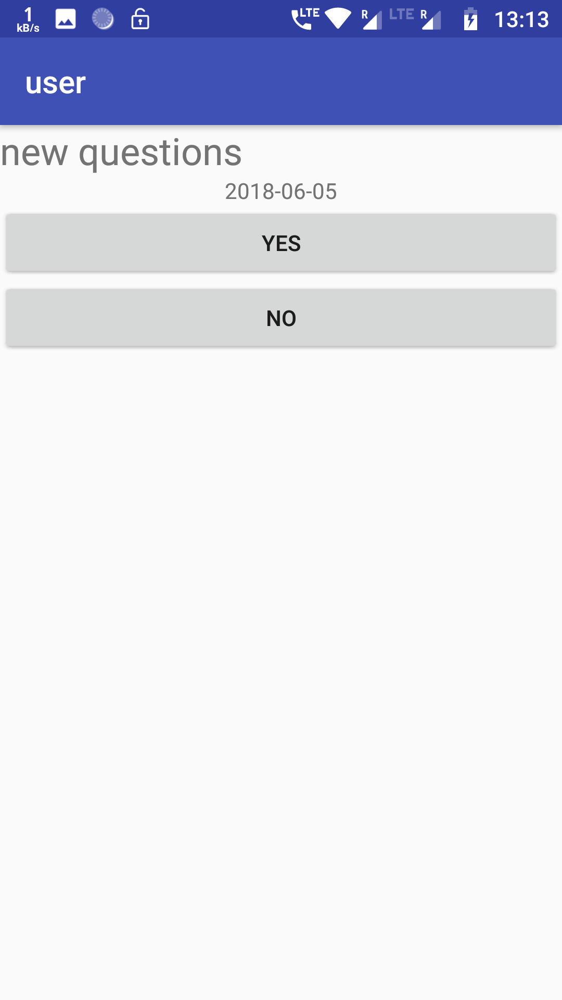

# User Application for Voting Application
This is the user Application made for a mobile based voting system.

# Here user can Login/Register

 

The data base is stored on an online server with PHP backend.

# Questions

User Can see all the question added by the admin and select(only once) any questoion and submit answer in Yes/No.

 

The analysis of all the answers by the user can be seen by the admin in admin application.

<a href="https://github.com/neel1998/Admin">Link to the admin application</a>
